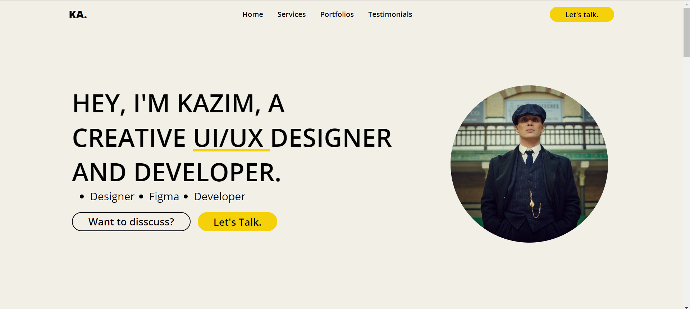

# 📚 Personal Portfolio Web Design - UI/UX Designing

Bienvenue dans le projet **Personal Portfolio Web Design - UI/UX Designing** ! Ce projet vise à reproduire le design HTML et CSS de l'image se trouvant dans le dépôt du projet, nommée "Personal Portfolio Web Design - UI UX Designing.png".

## 🌟 Aperçu



## 📜 Description du projet

Ce projet est une page web personnelle qui met en avant les compétences et les services de Kazim, un designer UI/UX et développeur. La page est conçue pour être responsive et attrayante, avec une mise en page moderne et des éléments interactifs.

### Fonctionnalités

- **En-tête** : Contient le logo et la navigation principale.
- **Hero Section** : Présente Kazim avec une brève description et des boutons d'appel à l'action.
- **Compétences** : Liste des compétences de Kazim.
- **Services** : Présentation des services offerts.
- **Portfolio** : Galerie des projets réalisés.
- **Témoignages** : Avis des clients.
- **Footer** : Informations de contact et liens vers les réseaux sociaux.

## 🛠️ Technologies utilisées

- **HTML** : Structure de la page web.
- **CSS** : Stylisation de la page web.
- **Google Fonts** : Utilisation de polices de caractères personnalisées.

## 📁 Structure du projet

```
Portofolio-Kazim/
│
├── images/
│   └── apercu.png
│   ├── facebook.png
│   ├── gmail.png
│   ├── instagram.png
│   ├── linkedin.png
│   ├── photo-kazim.jpg
│   ├── service-icon.png
├── index.css
├── index.html
├── Personal Portfolio Web Design - UI UX Designing.jpg
├── README.md
└── ...
```

## 💻 Comment utiliser

1. Clonez ce dépôt sur votre machine locale :
   ```sh
   git clone https://github.com/Maximus203/Portofolio-Kazim.git
   ```

2. Ouvrez le fichier `index.html` dans votre navigateur pour voir la page en action.

## 🌐 Déploiement

Ce projet est déployé sur GitHub Pages. Vous pouvez le consulter à l'adresse suivante :
[https://cherif-diouf.me/Portofolio-Kazim/](https://cherif-diouf.me/Portofolio-Kazim/)

## 🤝 Contribuer

Les contributions sont les bienvenues ! Si vous avez des suggestions ou des améliorations, n'hésitez pas à ouvrir une issue ou à soumettre une pull request.

## 📧 Contact

Pour toute question ou suggestion, vous pouvez me contacter à [printf0cherif@gmail.com](mailto:printf0cherif@gmail.com).
